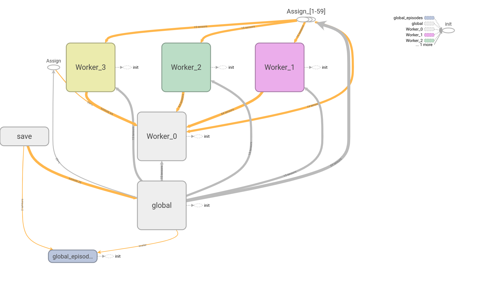

# ML Driven Treatment Scheduling

Code repository for [Learning to Adapt - Deep Reinforcement Learning in Treatment-Resistant Prostate Cancer](https://doi.org/10.1101/2023.04.28.538766).
Trains an [A3C](https://arxiv.org/abs/1602.01783) Deep Reinforcement Learning (DRL) model to treat a virtual cancer patient, modelled by a simple Lotka-Volterra ODE model.

## Repository Index

* [`demo`](demo) Documented example scripts for single and multi-patient training
* [`images`](images) Image outputs files to document research. Does not contain final paper images.
* [`models`](models) Pre-trained models, for use in evaluation and figure scripts
* [`paper_figures`](paper_figures) All code used to generate figures for the [paper](https://doi.org/10.1101/2023.04.28.538766)
* [`utils`](utils) Utility functions used in training and figure generation, including [virtual patient model](utils/LotkaVolterraModel.py)

## Setup Instructions <a name="SetUp"></a>

To setup up the Python environment within which to run this:

```buildoutcfg
conda create -n DRL_env_tf15 python=3.5 seaborn tqdm py4j
conda activate DRL_env_tf15
pip install tensorflow==1.5
conda install ipykernel
```

The main script `evaluate.py` can be ran from the `demo/` directory, and evaluated the performance of a pre-trained model (generated using the `train.py` script).

## Model Evaluation

### Workflow Summary

The section describes the workflow implemented in `evaluate.py` - it does not need to be implemented manually by a user but provides a step-by-step guide to the functionality of this script.

It uses a pre-trained model, as implemented in `train.py` with classes from `drlModel.py`. This created a Worker class which copies the network - multiple workers can be ran asynchronously to generate the A3C network.

1. Define parameters for model. This includes parameters for both the DRL model, such as reward metric and allowed treatments, and for the tumour model. It is also possible to define the model and results filepaths at this point. Further details of this are available in a separate file `parameters.md`.

2. Set up the A3C network - contains one global network, and num_workers copies used during training to increase learning performance. This is imported from `utils/drlModel`, and initialised with the parameters provided in step 1.

3. DRL Model is repeatedly evaluated on an instance of the virtual patient (represented by a ODE system), parametrised as in step 1. This requires repeated iteration over time, until and end condition is reached (either 100 years survival, or tumour growth passed 1.2 times the original size).

    1. Record the current state of the system in an internal observation list. This contains the initial tumour size, the tumour sizes each day for the past week and the daily growth (i.e. the per-day change for each day over the past week).
    2. Decide on next treatment using probabilities from policy network output, based on the observation input.
    3. Treat the patient and observe the response.
    4. Calculate the reward from that action.
    5. Record this timestep - see detail [below](#reading-output-files).

Various model performance metrics are then calculated from this output file in `demo/jnb_analysis.ipynb`.

### Reading Output Files

It uses a pre-trained model, as implemented in `train.py` with classes from `drlModel.py`. This created a Worker class which copies the network - multiple workers can be ran asynchronously to generate the A3C network.
Output data is stored as a list of dictionaries per timestep, which are then converted into a pandas Dataframe for csv output. This contains the following columns:

- `ReplicateId` - Iteration Number
- `Time` - Timestep (i.e. the time the current treatment starts at)
- `S` - Volume\* of susceptible cells in tumour (not accessible to DRL model)
- `R` - Volume\* of resistant cells in tumour (not accessible to DRL model)
- `TumourSize` - Volume\* of total tumour - i.e. the sum of `S` and `R` (accessible to DRL model)
- `Support_Hol`: Probability of taking Treatment action
- `Support_Treat`: Probability of taking Holiday action
- `Action` - Action taken in timestep - either "H" for Holiday or "T" for Treatment
- `DrugConcentration` - Concentration of drug delivered in treatment (0 if holiday)

Note that values such as the cell distribution within the tumour are output for analysis, but this information is not available to the DRL during evaluation. See step 3.1 in the [workflow summary](#workflow-summary) for more information on the data provided to the DRL model.

\* I.e. A continuous metric directly proportional to the number of cells in the tumour.

## Model Training

### ODE Model Details

The DRL model was trained on a virtual patient, represented by an ODE model. This was a simple 2-population Lotka-Volterra tumour model, where $S$ is the number of susceptible cells, and $R$ is the number of resistant cells.

$$
\frac{dS}{dt} = r_{S} S \left(1 - \frac{S+R}{K}\right) \times (1-d_{D}D) - d_{S}S, \\\\
\frac{dR}{dt} = r_{R} R \left(1 - \frac{S+R}{K}\right) - d_{R}R
$$

Both species follow a modified logistic growth model with growth rates $r_{S}$ and $r_{R}$, where the total population (rather than the species population) is modified by the carrying capacity $K$.

For the susceptible population, this growth rate is also modified by the drug concentration $D$ and the killing rate of the drug $d_{D}$.

Finally, both species have a natural death rate, of $d_{S}$ and $d_{R}$ respectively.

This model is implemented in the `LotkaVolterraModel` class, which inherits from `ODEModel`. This parent class sets parameters such as error tolerances for the solver, and then solves the ODE model for each treatment period sequentially.

### DRL Architecture

The A3C network consists of a global network, with many duplicates (workers) updating to this asynchronously). An example (run on a machine with 4 cores, and so 3 workers) is given below:



Each network (global or worker) takes in 15 dimensional input:

- Initial tumour size
- Tumour size for the last 7 timesteps
- Tumour growth for the last 7 timesteps (I.e. differences between sequential tumour size measurements)

1. Input Layers
    - LSTM – Long Short Term Memory layer, gives 15-dimensional output. Can detect useful time-lagged correlations between components?

2. Hidden Layers
    - Fully connected layers for each size in [128, 64, 32, 16, 10]
    - Each are multiplied by the previous output to produce a Tensor of hidden units.
    - Uses a rectified linear activation function

3. Output Layers
    - Policy - Fully connected layer of output size `n_DoseOptions`, softmax activation function
    - Value- Fully connected layer of output size 1, no activation function (linear behaviour)

### Reward Function

- Base reward of 0.1 per cycle (timestep) survived
- Additional reward of 0.05 for cycles without treatment
- Punishment of –0.1 for exceeding 20% tumour growth
- Ultimate reward of 5 for indefinite survival (100 years*)

This uses discounting to determine how important future rewards are to the current state, based on a discount factor ($\gamma$) between 0 and 1. A reward R that occurs N steps in the future from the current state, is multiplied by $\gamma^{N}$ to describe its importance to the current state.

As well as ensuring all reward sums therefore converge, this factor is used to prioritise shorter term results given uncertainty in future behaviour of the system (tumour). However the value tends to be very close to one, to avoid particularly short-sighted decisions, as we are primarily focused on the final outcome in this context.

### Training Output

The `training.py` script will generate a number of files in the `models/` directory, including checkpoints of the trained model, and log files of the training.

The model checkpoints are saved regularly, and stored in directories such as `demo/models/ThuMar311244502022/100_patients_ThuMar311244502022`. These can be read back into tensorflow for further training or evaluation using the `tf.train.get_checkpoint_state()` function.

The log files for training are not essential for evaluation, but may be useful to determine the state of training - they are updated iteratively and so can be viewed while training is still running. They may be viewed with [tensorboard](https://www.tensorflow.org/tensorboard/get_started), which can be run using `tensorboard --logdir path/to/logs` from the home directory, and accessed at `http://localhost:6006`. These are provided on a per-worker basis, and also to summarise the global network.

A treatment history is also provided for each worker, giving a history of the complete treatment schedule delivered to each virtual patient used in training, and their survival time (i.e. time to progression).

Finally, a parameters file is provided to detail the parameter values used in this simulation.
